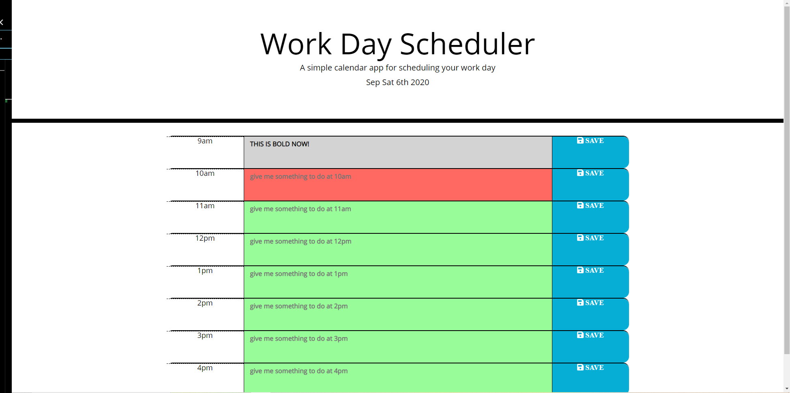

## ====================================
##  WORK DAY SCHEDULER
## ====================================

## Link to Project Github
https://github.com/modern-sapien/work-day-scheduler/

## Link to Live Site
https://modern-sapien.github.io/work-day-scheduler/

## Work Day Scheduler
I created a work day event scheduler using jQuery, bootstrap and a whole lot of time spent figuring out how to have an object's information populate from local storage.

## The Prompt
The prompt for this task was to create a planner that was dynamically generated using jQuery that would track the current hour and allow a user to save upcoming events in their planner using local storage. 

## Approach

As with past projects, I created a process.md file to help strategize my way through what I should focus on during the project and how best I could move forward. Using this method often gives me the chance to understand a project more fully and allow me to plan for growth or potential roadblocks. 

It was apparent that I needed to use a For Loop to generate a bulk of the content for this homework & assign classes & values that I would later be able to change based on either the current time or on a click to store data.

The next step was to store & collect the data, to do this I created an on click event for the container I generated my content within that would store information based on sibling text & values that would then be stored into the local storage object & rendered on the page upon refresh.

Moment.js is a powerful tool used across a multitude of projects, but for this project all I needed it to do was generate a value and display the day, month & year in a heading. Initially I tried to see if Moment.js would view a string of time as a value i.e. 9am < 9pm, but after quickly remember that strings don't work like this in real life. I created a variable that tracked the current hour in military time and then as I was iterating through my For Loop use this Moment.js current hour value against the momentHours array values to assign classes to the text areas that needed to indicate if we were in the past, present or future in our planner.

## CONSIDERATIONS

When you are learning something you often don't have the language to articulate what it is you are trying to do, or what you don't know. I completed most of the work for this homework on day one of working on it and then spent the better part of two days  trying to figure out how to access the information stored on my object. I talked to TA's, my instructor, fellow students, & I watched youtube videos and looked at other people's code & while other people's approaches worked in how they built their project. They didn't seem appropriate for mine.

As I was staring at my empty object save for the initial hour keys of 9am to 5pm, & an array of the same values at 10am. It finally dawned on me that I could literally use that array as a way to access the values of the object as I pulled it back from storage to dynamically generate user content onto the page. 

As evidenced by my commits & one reflog, this was a lesson well learned.

## Many Thanks

Thank you to my instructor for trying to present this torrent of informaiton in a way that is accessible!

Thank you to my TA's for always being willing to experiment and troubleshoot through problems with myself and other students.

Thank you to my fellow students in this program and for their tenacity and ability to approach things from their own space of expertise. 

Thank you to this project for giving me valuable lessons in coding & teaching me that errors are good things and that if something doesn't work... GIT BASH is more forgiving than real life.

